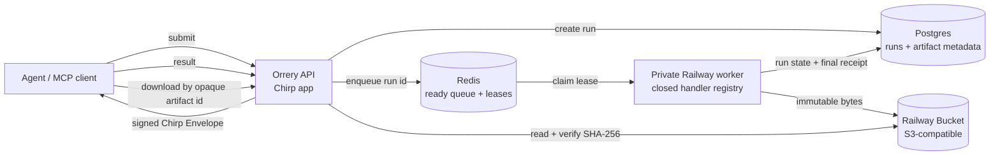
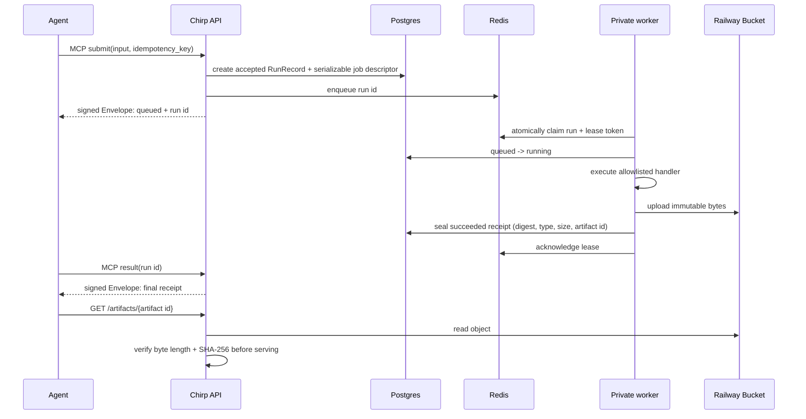

# Managed artifact execution

Orrery's first durable execution lane turns small CPU workloads into verifiable
files without making an MCP request wait for rendering. It is deliberately a
small, operationally honest foundation: one private worker service executes a
closed set of built-in workloads. It is **not** yet a per-job sandbox or GPU
executor.

## System boundary

Railway hosts four private/public roles in the production project:

| Role | Responsibility | Public? |
| --- | --- | --- |
| API service | Chirp/MCP endpoints, admission, result lookup, artifact download | Yes (`orrery.lol`) |
| Worker service | Lease consumer and built-in CPU handlers | No |
| Postgres | Run lifecycle and artifact metadata / receipts | No |
| Redis | Ready work, leases, retry timing, dead letters | No |
| Railway Bucket | PDF, CSV, and PNG bytes | No direct public endpoint |

The API and worker share source code but have separate Railway service roles.
`ORRERY_PROCESS_KIND=worker` starts the worker entry point; the API leaves it
unset and starts the Chirp app. This prevents adding a worker from silently
creating a second web replica.

## Request-to-artifact flow

`submit` never renders a file in the API process. The worker accepts only the
registered workload kinds `html-to-pdf`, `csv-report`, and `image-transform`;
it never dynamically imports caller-provided code.

The result is a Chirp-signed Envelope. Its terminal payload records the
executor, workload, policy snapshot, content type, filename, byte length,
artifact ID, artifact URL, and SHA-256. The client should retain that receipt
and verify the downloaded bytes against its digest.

## Why Redis and Postgres both exist

Postgres is the durable system of record. It holds the run state machine and
the immutable terminal receipt. Redis is the coordination plane that lets
workers claim and retry quickly:

| Redis structure | Meaning |
| --- | --- |
| job hash + ready sorted set | queued runs, ordered by availability |
| lease sorted set | current worker ownership and expiry |
| dead-letter list | terminal queue failures with reason |

The queue uses Redis Lua scripts for atomic enqueue, claim, heartbeat,
acknowledgement, retry, expired-lease recovery, and dead-letter moves. A lease
token fences an old worker from acknowledging a job after its ownership has
expired. The worker heartbeats before the lease expires; failures retry with a
bounded attempt count, then become a durable failed run with an observable
reason.

Redis is intentionally **not** the authoritative receipt store. If a worker
dies, a later worker recovers its lease from Redis and reconciles the final
Postgres state via `runs.reconcile.RunReconciler`, which emits compact
`AuditEvent` records (dead-letter seal, orphan repair, terminal queue drop,
seal-race). Operators can read a bounded summary from the worker probe
(`OperatorRunHealth` / `/health`) — queue depth/age, audit counters, cleanup
lag, optional artifact byte totals — never artifact bodies or credentials.
See issue [#158](https://github.com/lbliii/orrery/issues/158).

## Chirp, Shapes, and Pelt

Chirp is actively used at the product boundary:

- `Skill` definitions expose the MCP tools and return signed Ed25519 Envelopes.
- Direct Star MCP endpoints provide each Star's natural tool namespace.
- The Chirp app hosts `/mcp`, the public Star routes, discovery, middleware,
  and the existing publish-oracle surfaces.

Orrery does **not currently use** Chirp Data Shapes or Pelt in this execution
lane:

- **Shapes** are Chirp's typed async SQL-to-frozen-dataclass read-model layer.
  They are valuable for operator views—run history, dead-letter lists, and
  artifact inventories—but do not replace the queue or binary object storage.
- **Pelt** is Chirp Data's in-tree PostgreSQL driver and pool behind
  `chirp.data.Database`. Orrery currently uses small synchronous `psycopg`
  repositories for the run and artifact state machines, so Pelt is present in
  the Chirp dependency but is not instantiated by the application.
- Chirp also has a private provisional Postgres durable-job store. We did not
  adopt it because this lane required a Redis-backed queue, independent worker
  runtime, and closed handler registry now; that store is not yet the public
  app-lifecycle/executor abstraction for this use case.

A good follow-up is to introduce Chirp `Database` + Shapes for read-only
operator projections first, then evaluate a deliberate migration from the
current repositories to Pelt. That is a maintainability upgrade, not a reason
to destabilize the working delivery path.

## Execution boundary and next steps

The present worker is a separate Railway service and has resource policy
metadata, but it does not start a fresh container for each run. Consequently,
it should be described as a **managed worker** rather than a fully isolated
per-job compute platform. GPU and third-party creator executors remain separate
future adapters.

For retention, deletion, download access, and an agent's own copy/acknowledgment
semantics, see [artifact lifecycle operations](../operations/artifact-lifecycle.md).
