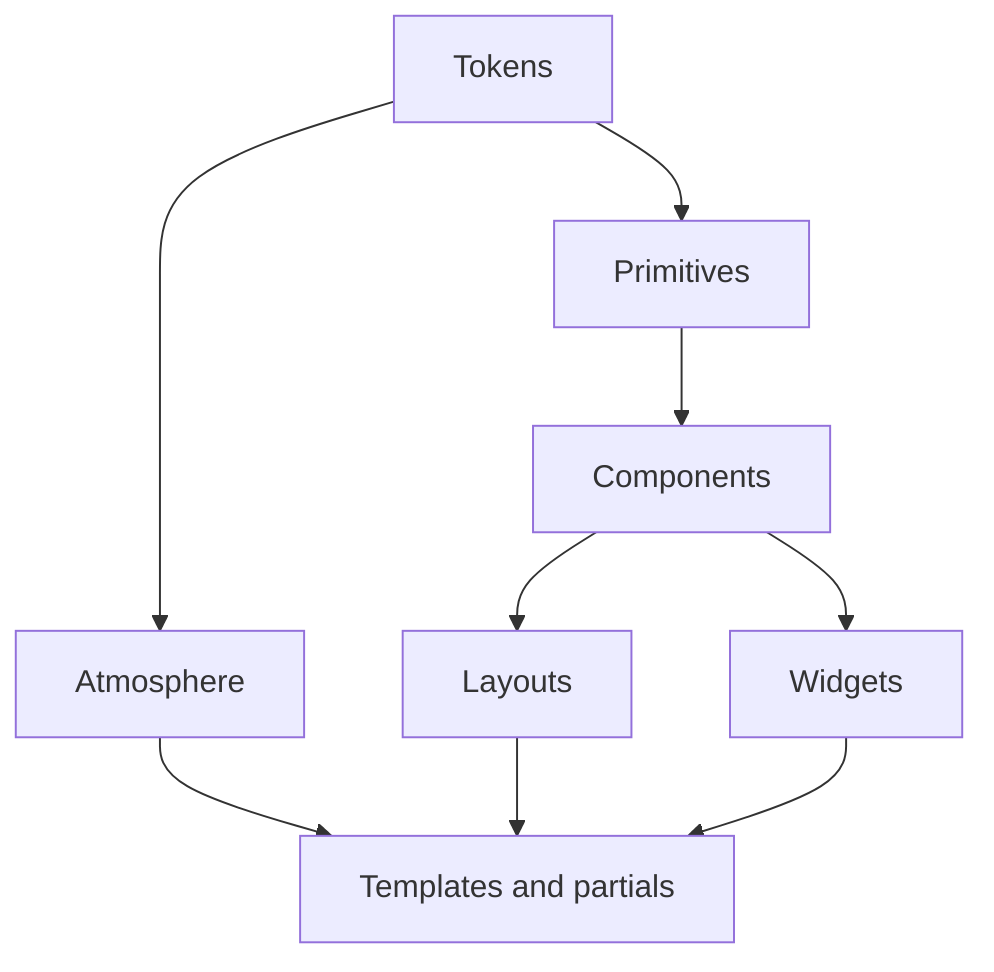

# Orrery design system

Layered inventory of the night-observatory UI. Soft bind: product nouns stay
celestial; structural classes stay plain. See [`identity.md`](./identity.md).
Motion beats: [`motion.md`](./motion.md). Freeze: [#472](https://github.com/lbliii/orrery/issues/472).

Live CSS is layered files under [`static/css/`](../../static/css/). Sole `:root`
catalog: [`tokens.css`](../../static/css/tokens.css). Shim:
[`static/styles.css`](../../static/styles.css) `@import`s the layers. Mock twin:
[`design/styles.css`](../../design/styles.css) (frozen reference, not live).

| Layer | Path |
| --- | --- |
| Tokens | [`static/css/tokens.css`](../../static/css/tokens.css) |
| Base | [`static/css/base.css`](../../static/css/base.css) |
| Atmosphere | [`static/css/atmosphere.css`](../../static/css/atmosphere.css) |
| Primitives | [`static/css/primitives.css`](../../static/css/primitives.css) |
| Components | [`static/css/components.css`](../../static/css/components.css) |
| Widgets | [`static/css/widgets.css`](../../static/css/widgets.css) |
| Layouts | [`static/css/layouts.css`](../../static/css/layouts.css) |
| Motion | [`static/css/motion.css`](../../static/css/motion.css) |

Taste over kit. No ChirpUI names. No `.p-4` utilities. Later CSS does not
invent brand hex or raw `80` / `180` / `280` / `360ms`.

## 1. Tokens

Defined once on `:root` in `tokens.css`:

### Color

| Token | Value | Role |
| --- | --- | --- |
| `--void` | `#070b12` | Page depth |
| `--night` | `#0d1520` | Panel fill |
| `--night-2` | `#121c2a` | Raised fill |
| `--signal` | `#d4e4f0` | Primary text |
| `--fog` | `#9aafc2` | Secondary text |
| `--mist` | `#6d8296` | Tertiary text |
| `--brass` | `#c4a06a` | Lock, commit, brand accent |
| `--brass-dim` | `#8a6d42` | Dimmed brass |
| `--phosphor` | `#7ec8a3` | Verified / live / gate-pass |
| `--danger` | `#c47a7a` | Fail / forge reject — use this, not `#f07178` |
| `--ink` | `#140f08` | Dark writing / warm surface ink |
| `--line` | `color-mix(… signal 12%)` | Hairline |
| `--glass` | `color-mix(… night-2 68%)` | Frosted surface |

### Type

| Token | Value | Role |
| --- | --- | --- |
| `--font-display` | Bricolage Grotesque | Chrome |
| `--font-body` | Source Serif 4 | Prose |
| `--font-mono` | IBM Plex Mono | Machine |
| `--text-kicker` | `0.78rem` | Uppercase labels |
| `--text-body` | `1.05rem` | Body size |
| `--text-mono` | `0.9rem` | Machine size |
| `--text-mono-dense` | `0.78rem` | Dense machine / code |
| `--text-prose-h2` | `1.35rem` | Prose section heading |
| `--text-prose-h3` | `1.15rem` | Prose subsection heading |
| `--text-lede` | `1.05rem` | Supporting paragraph |
| `--leading` | `1.55` | Body line-height |

No `xs`–`3xl` type ramp. `.prose` / `.sample` primitives in [#501](https://github.com/lbliii/orrery/issues/501).

### Space

Consumed by primitives — not utility classes.

| Token | Value |
| --- | --- |
| `--space-1` | `0.35rem` |
| `--space-2` | `0.75rem` |
| `--space-3` | `1.5rem` |
| `--space-4` | `2rem` |
| `--space-5` | `3.5rem` |

### Shape

| Token | Value | Role |
| --- | --- | --- |
| `--radius` | `2px` | Sharp instrument edge |
| `--radius-orb` | `50%` | Disks / live-dot |
| `--stroke` | `1px` | Hairline width |

### Motion

| Token | Value | Beat |
| --- | --- | --- |
| `--tick` | `80ms` | Press |
| `--flash` | `180ms` | Copied / short fades |
| `--settle` | `280ms` | Arrive / settle |
| `--seal` | `360ms` | Seal / reveal edges |
| `--ease` | `cubic-bezier(0.22, 1, 0.36, 1)` | Shared curve |

### Glow / z

| Token | Role |
| --- | --- |
| `--glow-brass` | Orb / brass halo |
| `--glow-phosphor` | Sealed receipt halo |
| `--z-cosmos` | Sky stack (`0`) |
| `--z-shell` | Content above sky (`1`) |

Do not tokenize orb coordinates, constellation `--step`, theme modes, or
`--chirpui-*`.

## 2. Atmosphere

Global, non-interactive sky in [`pages/_layout.html`](../../pages/_layout.html):

- `.cosmos`, `.cosmos-milky`, `.cosmos-dust`
- `.cosmos-stars`, `.cosmos-stars-far|mid|near`
- `.cosmos-meteor`, `.cosmos-vignette`

Effects must fade to transparent before any clip edge. Prefer soft masks over
hard `overflow: hidden` when glows extend past a box.

## 3. Primitives

| Class | Role |
| --- | --- |
| `.brand` | Wordmark |
| `.kicker` | Uppercase section label |
| `.lede` | Supporting paragraph |
| `.muted` | De-emphasized copy |
| `.mono` | Machine strings |
| `.btn`, `.btn-ghost`, `.btn-brass` | Actions |
| `.pill`, `.pill-ok\|pay\|free\|fail\|priv` | Status chips |
| `.price` | Commerce emphasis |
| `.field` | Shared form control (also `.resolve-row` / `.lookup` inputs) |
| `.alert` | Fail / status line (`--danger`) |
| `.stack` | Vertical gap via `--space-2` |
| `[x-cloak]` | Hide Alpine until ready |
| `.table-row-link` | Clickable row / row-shaped link |
| `.prose` | Markdown body (Patitas wrapper; `#499`) |
| `.sample`, `.sample.dense` | Code / JSON samples (Rosettes wrapper; `#499`) |
| `a` | Link (inherits; brass on hover) |

## 4. Components

Reusable across routes:

| Class | Role |
| --- | --- |
| `.topbar`, `.nav`, `.footer`, `.footer-cluster`, `.skip-link` | Chrome |
| `.panel` | Glass content block |
| `.lookup`, `.resolve-row` | Lookup form row |
| `.meta-list` | Label → value rows |
| `.record-table` | Skill DNS zone table |
| `.table-scroll` | Horizontal overflow wrapper for wide tables |
| `.steps` | Numbered how-it-works list |
| `.live-dot` | Live indicator |
| `.legend` | Graph key |

## 5. Widgets (signature)

| Widget | Role | Primary route |
| --- | --- | --- |
| `.orb-stage` / `.orb-svg` | Brand visual anchor | `/` |
| `.receipt` + `[data-receipt]` seal states | Envelope proof | `/stars` |
| `.verify-ok` / `.verify-fail` | Seal result | `/stars` |
| `.constellation` + SVG motion | Drawn policy graph | `/constellations` |
| `.gaze-nodes` / `.gaze-node` / `.gaze-hits` | Discovery console | `/gaze` |
| `.feed` / `.activity*` | Live invocations | `/` |
| `[data-digest].value-settled` | Resolve settle flash | `/resolve` |
| `.resolve-demo` | Home resolve affordance | `/` |

## 6. Layouts

| Class | Role |
| --- | --- |
| `.shell` | Centered content column |
| `.hero`, `.hero-copy`, `.hero-actions` | Landing composition |
| `.ns-hero`, `.detail-hero`, `.console-head` | Page intros |
| `.section` | Content section |
| `.detail-grid`, `.ns-grid` | Multi-column bodies |
| `.featured` | Emphasized ns-grid cell |
| `.catalog-*`, `.star-*` | Public sky / star field guide |

## 7. Templates / partials

| Kind | Path |
| --- | --- |
| Layout | [`pages/_layout.html`](../../pages/_layout.html) |
| Nav context | [`pages/_context.py`](../../pages/_context.py) |
| Surfaces | [`pages/page.html`](../../pages/page.html), `pages/{gaze,resolve,stars,constellations,namespaces}/` |
| Partial | [`pages/_feed.html`](../../pages/_feed.html) |
| Frozen reference | [`design/`](../../design/), [`design/v1-night-gold/`](../../design/v1-night-gold/) |

## Route matrix

| Route | Layout | Widgets |
| --- | --- | --- |
| `/` | `.hero` + `.section` | `.orb-stage`, `.resolve-demo`, `.feed` |
| `/gaze` | `.console-head` + `.detail-grid` | `.gaze-nodes`, `.gaze-hits` |
| `/resolve` | `.console-head` | `.lookup`, `.record-table` (in `.table-scroll`) |
| `/stars` | `.detail-hero` + `.detail-grid` | `.receipt`, `.meta-list`, `.price` |
| `/constellations` | `.console-head` + `.detail-grid` | `.constellation`, `.legend` |
| `/namespaces` | `.ns-hero` + `.ns-grid` | (compositional only) |
| `/console` | Chirp-owned ops reliability console | Footer **Ops · console** only; not primary nav |

## Effects + responsive contract

1. **No hard glow clips.** Signature glows (orb, constellation wash, receipt
   seal) fade with a soft mask or stay inside a box that does not cut them
   into a rectangle.
2. **Hero stays one composition.** Cap tall viewports; anchor the orb to the
   copy cluster, not the viewport top.
3. **Breakpoints**
   - `max-width: 860px` — stack grids, denser orb, single-column forms
   - `861px–1100px` / `min-width: 1400px` — orb scale/placement
   - `min-height: 960px` — center hero composition
4. **Motion** — sparse named beats; all continuous animations honor
   `prefers-reduced-motion: reduce`. See [`motion.md`](./motion.md).
5. **Wide tables** — wrap `.record-table` in `.table-scroll` so narrow
   viewports scroll horizontally instead of blowing the shell.

## Chrome / nav

Primary nav: **Product ▾** (native `
`) + **Connect**
(`.btn.nav-cta`). Nav state lives in [`pages/_context.py`](../../pages/_context.py)
(`nav.product` + per-route flags). Product children include `/star/*`.

- **Product menu stays closed on load.** Never set `open` on `
` because
  a child route is current; highlight the trigger with `.is-active` via
  `nav.product` instead.
- **Dismiss:** Alpine on the details only — `@click.outside` and
  `@keydown.escape.window` remove `open`. Not in `motion.js`.
- **Connect CTA:** `.nav a.btn` / `.nav-cta` resets text to `--ink` on brass
  (`.nav a { color: var(--mist) }` must not win).
- **Skip link:** `.skip-link` → `#main`, visually hidden until `:focus`.

## Footer

Brand line once: **Orrery · skills you point at, not install.** Three named
clusters (`.footer-cluster`), not a middot soup:

| Cluster | Links |
| --- | --- |
| Loop | Gaze · Resolve · Stars · Constellations · Receipts |
| Legal | Security · Privacy · Terms · Contact |
| Agents | Connect · `llms.txt` · Ops · console |

Page-level `footer_note` / `footer_meta` overrides are ignored — the shell owns
the footer copy.

## `/console` note

`/console` is Chirp host **ops** (`mount_console`), not a product surface.
Product routes sit under the Product dropdown; the **Agents** footer cluster
links **Ops · console**. Product trust is the Resolve/Star oracle pill. Orrery
does not restyle Chirp console chrome unless a theming hook lands upstream.
