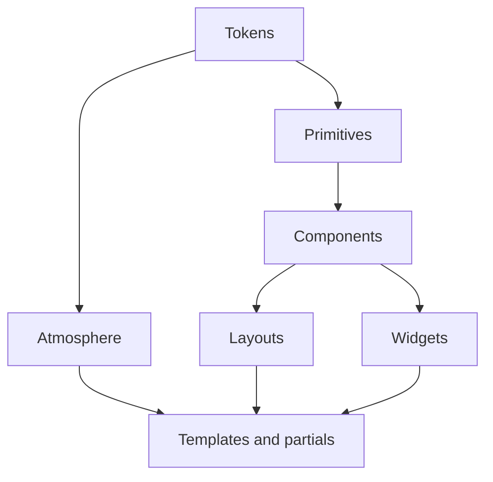

# Orrery design system

Layered inventory of the night-observatory UI. Soft bind: product nouns stay
celestial; structural classes stay plain. See [`identity.md`](./identity.md).

Live CSS: [`static/styles.css`](../../static/styles.css) (single file, sectioned
by layer). Mock twin: [`design/styles.css`](../../design/styles.css).

## 1. Tokens

Defined on `:root`:

| Token | Role |
| --- | --- |
| `--void`, `--night`, `--night-2` | Depth / panel fill |
| `--signal`, `--fog`, `--mist` | Primary / secondary / tertiary text |
| `--brass`, `--brass-dim` | Lock, commit, brand accent |
| `--phosphor` | Verified / live / gate-pass |
| `--danger` | Fail / forge reject |
| `--line`, `--glass` | Hairline + frosted surface |
| `--font-display`, `--font-body`, `--font-mono` | Chrome / prose / machine |
| `--radius` | Sharp instrument edge (2px) |
| `--ease` | Shared motion curve |

## 2. Atmosphere

Global, non-interactive sky in [`pages/_layout.html`](../../pages/_layout.html):

- `.cosmos`, `.cosmos-milky`, `.cosmos-dust`
- `.cosmos-stars`, `.cosmos-stars-far|mid|near`
- `.cosmos-meteor`, `.cosmos-vignette`

Effects must fade to transparent before any clip edge. Prefer soft masks over
hard `overflow: hidden` when glows extend past a box.

## 3. Primitives

| Class | Role |
| --- | --- |
| `.brand` | Wordmark |
| `.kicker` | Uppercase section label |
| `.lede` | Supporting paragraph |
| `.muted` | De-emphasized copy |
| `.mono` | Machine strings |
| `.btn`, `.btn-ghost`, `.btn-brass` | Actions |
| `.pill`, `.pill-ok\|pay\|free\|fail\|priv` | Status chips |
| `.price` | Commerce emphasis |
| `a` | Link (inherits; brass on hover) |

## 4. Components

Reusable across routes:

| Class | Role |
| --- | --- |
| `.topbar`, `.nav`, `.footer` | Chrome |
| `.panel` | Glass content block |
| `.lookup`, `.resolve-row` | Lookup form row |
| `.meta-list` | Label → value rows |
| `.record-table` | Skill DNS zone table |
| `.table-scroll` | Horizontal overflow wrapper for wide tables |
| `.steps` | Numbered how-it-works list |
| `.live-dot` | Live indicator |
| `.legend` | Graph key |

## 5. Widgets (signature)

| Widget | Role | Primary route |
| --- | --- | --- |
| `.orb-stage` / `.orb` | Brand visual anchor | `/` |
| `.receipt` + `[data-receipt]` seal states | Envelope proof | `/stars` |
| `.verify-ok` / `.verify-fail` | Seal result | `/stars` |
| `.constellation` + SVG motion | Drawn policy graph | `/constellations` |
| `.gaze-nodes` / `.gaze-node` / `.gaze-hits` | Discovery console | `/gaze` |
| `.feed` / `.activity*` | Live invocations | `/` |
| `[data-digest].value-settled` | Resolve settle flash | `/resolve` |
| `.resolve-demo` | Home resolve affordance | `/` |

## 6. Layouts

| Class | Role |
| --- | --- |
| `.shell` | Centered content column |
| `.hero`, `.hero-copy`, `.hero-actions` | Landing composition |
| `.ns-hero`, `.detail-hero`, `.console-head` | Page intros |
| `.section` | Content section |
| `.detail-grid`, `.ns-grid` | Multi-column bodies |
| `.featured` | Emphasized ns-grid cell |

## 7. Templates / partials

| Kind | Path |
| --- | --- |
| Layout | [`pages/_layout.html`](../../pages/_layout.html) |
| Nav context | [`pages/_context.py`](../../pages/_context.py) |
| Surfaces | [`pages/page.html`](../../pages/page.html), `pages/{gaze,resolve,stars,constellations,namespaces}/` |
| Partial | [`pages/_feed.html`](../../pages/_feed.html) |
| Frozen reference | [`design/`](../../design/), [`design/v1-night-gold/`](../../design/v1-night-gold/) |

## Route matrix

| Route | Layout | Widgets |
| --- | --- | --- |
| `/` | `.hero` + `.section` | `.orb-stage`, `.resolve-demo`, `.feed` |
| `/gaze` | `.console-head` + `.detail-grid` | `.gaze-nodes`, `.gaze-hits` |
| `/resolve` | `.console-head` | `.lookup`, `.record-table` (in `.table-scroll`) |
| `/stars` | `.detail-hero` + `.detail-grid` | `.receipt`, `.meta-list`, `.price` |
| `/constellations` | `.console-head` + `.detail-grid` | `.constellation`, `.legend` |
| `/namespaces` | `.ns-hero` + `.ns-grid` | (compositional only) |
| `/console` | Chirp-owned reliability console | Shares brand chrome via layout link only; not restyled here |

## Effects + responsive contract

1. **No hard glow clips.** Signature glows (orb, constellation wash, receipt
   seal) fade with a soft mask or stay inside a box that does not cut them
   into a rectangle.
2. **Hero stays one composition.** Cap tall viewports; anchor the orb to the
   copy cluster, not the viewport top.
3. **Breakpoints**
   - `max-width: 860px` — stack grids, denser orb, single-column forms
   - `861px–1100px` / `min-width: 1400px` — orb scale/placement
   - `min-height: 960px` — center hero composition
4. **Motion** — sparse; all continuous animations honor
   `prefers-reduced-motion: reduce`.
5. **Wide tables** — wrap `.record-table` in `.table-scroll` so narrow
   viewports scroll horizontally instead of blowing the shell.

## `/console` note

`/console` is mounted by Chirp (`mount_console`), not a `pages/` surface. It
inherits the site via the topbar link and shared CSS variables when Chirp
embeds into the same origin, but Orrery does not own its internal layout.
Gaps (generic host chrome vs night observatory) are documented here; do not
restyle the Chirp console unless a dedicated theming hook lands upstream.
